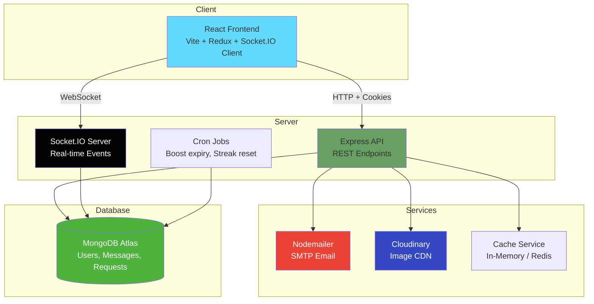

# 🚀 DevTinder Backend API

> Tinder for Developers — Connect, match, and collaborate with developers who share your passion.

[](https://nodejs.org)
[](https://expressjs.com)
[](https://mongodb.com)
[](https://socket.io)

---

## 📋 Table of Contents

- [Features](#-features)
- [Tech Stack](#-tech-stack)
- [Architecture](#-architecture)
- [Getting Started](#-getting-started)
- [API Documentation](#-api-documentation)
- [Socket.IO Events](#-socketio-events)
- [Database Schema](#-database-schema)
- [Testing](#-testing)
- [Deployment](#-deployment)
- [Contributing](#-contributing)

---

## ✨ Features

| Category | Features |
|----------|----------|
| **Auth** | JWT cookie-based, signup/login/logout, password reset via email |
| **Profiles** | Skills, experience level, location, GitHub integration, portfolio, availability |
| **Feed** | Smart matching (complementary skills), filters, pagination, boost, profile views |
| **Connections** | Interested/ignored/superlike, mutual match detection, undo, accept/reject |
| **Chat** | Persistent messages, typing indicators, read receipts, emoji reactions, file sharing |
| **Projects** | Post ideas, apply, tech stack tags, applicant tracking |
| **Challenges** | Weekly coding challenges, submissions, streak tracking |
| **Activity** | Stories/updates feed |
| **Notifications** | Real-time via Socket.IO (match, request, message, interest) |
| **Analytics** | Profile views, match rate, response rate, visibility score |
| **Admin** | Stats, CRUD challenges, ban/unban users, cache management |
| **Security** | Rate limiting (4 tiers), input validation, bcrypt hashing |
| **Performance** | In-memory cache (Redis-ready), cron jobs, pagination |
| **Media** | Cloudinary image upload (server-side signed) |
| **Email** | Nodemailer templates (reset, match, request notifications) |

---

## 🛠 Tech Stack

| Layer | Technology |
|-------|-----------|
| Runtime | Node.js 18+ |
| Framework | Express.js 4 |
| Database | MongoDB Atlas (Mongoose 8) |
| Real-time | Socket.IO 4 |
| Auth | JWT + bcrypt + cookie-parser |
| Email | Nodemailer |
| Upload | Cloudinary + Multer |
| Scheduling | node-cron |
| Rate Limiting | express-rate-limit |
| Validation | validator.js |
| Testing | Jest + Supertest + socket.io-client |
| Load Testing | Artillery |

---

## 🏗 Architecture



---

## 🚀 Getting Started

### Prerequisites
- Node.js 18+
- MongoDB Atlas account (or local MongoDB)
- npm or yarn

### Installation

```bash
git clone https://github.com/riteshyaaa/dev-tinder.git
cd dev-tinder
npm install
```

### Environment Variables

```bash
cp .env.example .env
# Edit .env with your values
```

Required variables:
| Variable | Description |
|----------|-------------|
| `MONGO_DB_USERNAME` | MongoDB Atlas username |
| `MONGO_DB_PASSWORD` | MongoDB Atlas password |
| `JWT_SECRET` | Secret key for JWT signing |
| `PORT` | Server port (default: 3000) |
| `CORS_ORIGIN` | Frontend URL |

### Run Development Server

```bash
npm run dev     # nodemon with hot reload
npm start       # production
```

### Seed Sample Data

```bash
npm run seed
# Creates 50 users, connections, messages, challenges, projects
# Login: alex.chen@devtinder.dev / Test@1234
```

---

## 📖 API Documentation

### Auth
| Method | Endpoint | Description |
|--------|----------|-------------|
| POST | `/signUp` | Register new user |
| POST | `/login` | Login (returns JWT cookie) |
| POST | `/logout` | Clear auth cookie |
| POST | `/auth/forgot-password` | Send reset code to email |
| POST | `/auth/reset-password` | Reset password with code |

### Profile
| Method | Endpoint | Description |
|--------|----------|-------------|
| GET | `/profile/view` | Get current user profile |
| PATCH | `/profile/edit` | Update profile fields |
| GET | `/profile/analytics?range=week` | Profile performance metrics |
| POST | `/profile/boost` | 30-minute visibility boost |

### Feed
| Method | Endpoint | Description |
|--------|----------|-------------|
| GET | `/feed` | Get feed (supports filters below) |

Query params: `?skills=React,Node&experienceLevel=senior&location=Remote&smartMatch=true&sortBy=smart&page=1&limit=10`

### Requests
| Method | Endpoint | Description |
|--------|----------|-------------|
| POST | `/request/send/:status/:toUserId` | Send interested/ignored/superlike |
| POST | `/request/review/:status/:requestId` | Accept/reject request |
| POST | `/request/undo/:userId` | Undo last ignored |

### User
| Method | Endpoint | Description |
|--------|----------|-------------|
| GET | `/user/connections?page=1&limit=20` | Accepted connections |
| GET | `/user/requests/received?page=1&limit=20` | Pending requests |

### Chat
| Method | Endpoint | Description |
|--------|----------|-------------|
| GET | `/chat/:targetUserId` | Message history + target user info |

### Projects
| Method | Endpoint | Description |
|--------|----------|-------------|
| GET | `/projects` | List open projects |
| POST | `/projects` | Create project |
| POST | `/projects/:id/apply` | Apply to project |

### Challenges
| Method | Endpoint | Description |
|--------|----------|-------------|
| GET | `/challenges` | List challenges |
| POST | `/challenges/:id/submit` | Submit solution |

### Activity
| Method | Endpoint | Description |
|--------|----------|-------------|
| GET | `/activity/feed` | List stories |
| POST | `/activity/story` | Post a story |

### Upload
| Method | Endpoint | Description |
|--------|----------|-------------|
| POST | `/upload/image` | Upload image (multipart/form-data) |

### Admin (requires admin email)
| Method | Endpoint | Description |
|--------|----------|-------------|
| GET | `/admin/stats` | Platform statistics |
| POST | `/admin/challenges` | Create challenge |
| DELETE | `/admin/challenges/:id` | Delete challenge |
| POST | `/admin/ban/:userId` | Ban user |
| POST | `/admin/unban/:userId` | Unban user |
| POST | `/admin/cache/flush` | Flush cache |

---

## 🔌 Socket.IO Events

| Event | Direction | Payload |
|-------|-----------|---------|
| `registerUser` | Client → Server | `{ userId }` |
| `joinChat` | Client → Server | `{ firstName, userId, targetId }` |
| `sendMessage` | Client → Server | `{ firstName, lastName, userId, targetId, text, imageUrl }` |
| `messageReceived` | Server → Client | `{ firstName, lastName, text, senderId, time }` |
| `typing` | Client → Server | `{ userId, targetId, firstName }` |
| `stopTyping` | Client → Server | `{ userId, targetId }` |
| `userTyping` | Server → Client | `{ firstName, userId }` |
| `messageRead` | Client → Server | `{ userId, targetId }` |
| `messagesRead` | Server → Client | `{ readBy }` |
| `addReaction` | Client → Server | `{ messageId, emoji, userId, targetId }` |
| `reactionReceived` | Server → Client | `{ messageId, emoji, fromUserId }` |
| `checkOnline` | Client → Server | `{ targetId }` |
| `onlineStatus` | Server → Client | `{ userId, online }` |
| `getOnlineUsers` | Client → Server | `{ userIds: [] }` |
| `onlineUsers` | Server → Client | `{ users: [] }` |
| `userOnline` | Server → Client (broadcast) | `{ userId }` |
| `userOffline` | Server → Client (broadcast) | `{ userId }` |
| `startCall` | Client → Server | `{ fromUserId, targetId, peerId }` |
| `incomingCall` | Server → Client | `{ fromUserId, peerId }` |
| `endCall` | Client → Server | `{ fromUserId, targetId }` |
| `callEnded` | Server → Client | `{ fromUserId }` |

---

## 🗄 Database Schema

### User
```javascript
{
  firstName, lastName, email, password, age, gender, photoUrl, about,
  skills: [String],           // max 15
  experienceLevel,            // junior | mid | senior | lead
  location,                   // "San Francisco, CA"
  currentlyBuilding,          // "A real-time collab tool"
  availability,               // open | busy | weekends | evenings
  lookingFor: [String],       // max 3: co-founder, mentor, etc.
  socialLinks: { linkedin, twitter, website },
  github: { username, avatarUrl, bio, totalStars, topRepos, languages },
  portfolio: [{ title, description, url, techStack }],
  challengeStreak, profileViews, lastActive, isBoosted, boostExpiresAt
}
```

### Message
```javascript
{ senderId, receiverId, text, imageUrl, fileUrl, fileName, read, reactions }
```

### ConnectionRequest
```javascript
{ fromUserId, toUserId, status: "interested|ignored|accepted|rejected" }
```

---

## 🧪 Testing

```bash
# Unit + Integration tests
npm test

# Socket.IO tests
npm test -- --testPathPattern=socket

# Load testing (requires Artillery globally)
npm install -g artillery
npm run seed              # Seed test data first
artillery run load-test.yml
```

---

## 🚢 Deployment

### Render.com (One-click)
The `render.yaml` is configured for automatic deployment. Connect the repo on Render dashboard.

### Docker
```bash
docker build -t devtinder-api .
docker run -p 3000:3000 --env-file .env devtinder-api
```

### Environment Setup for Production
Set these in your hosting platform:
- `MONGODB_URI` (full connection string)
- `JWT_SECRET` (strong random string)
- `CORS_ORIGIN` (your frontend Vercel/Netlify URL)
- `NODE_ENV=production`

---

## 🤝 Contributing

1. Fork the repository
2. Create a feature branch: `git checkout -b feat/your-feature`
3. Write tests for new functionality
4. Ensure all tests pass: `npm test`
5. Commit with conventional commits: `git commit -m "feat: add cool feature"`
6. Push and open a Pull Request

### Code Style
- Use `async/await` over callbacks
- All routes wrapped in try/catch
- Return JSON responses: `{ data }` or `{ error }` or `{ message }`
- Use descriptive variable names
- Add JSDoc comments for service functions

---

## 📄 License

ISC — [Ritesh Yadav](https://github.com/riteshyaaa)
